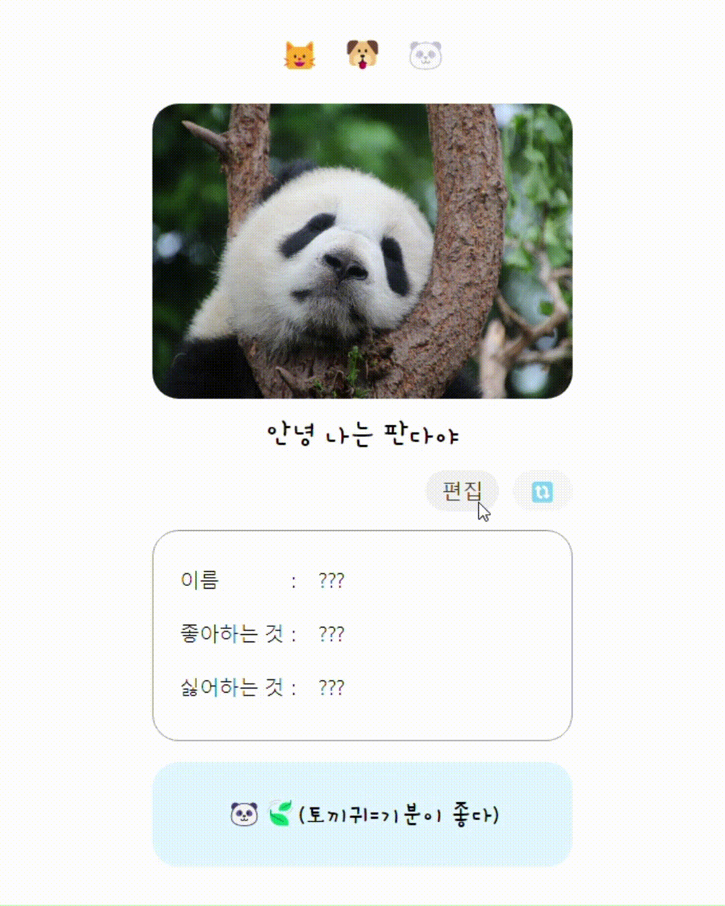

# Animal Profile

[프로젝트 배포 사이트 바로가기](https://badahertz52.github.io/animal_profile)

## 소개



<br/>

Recoil에 대한 공부를 목적으로 React와 Recoil을 사용해 만든 프로젝트입니다.
해당 사이트에서 동물 버튼을 클릭해 해당 동물의 프로필을 작성한 후 저장하면
작성된 프로필에 따라 허단에 시간차이를 두고 서로 다른 문장이 나타납니다.

## 설치 및 실행

### 설치

```bash
npm i
```

## 실행

```bash
npm run start
```

## 공부

Recoil을 공부하면서 이전에 사용해봤던 상태 관리 라이브러리인 Redux와 비교했을때 흥미로웠던 부분을 다음과 같습니다.

- 보다 코드가 깔끔하다.

  - props나 Context API를 사용해 상태나 상태를 변경할 액션 함수들을 필요한 컴포넌트까지 전달할 필요가 없다.

    - 상태를 읽고, 쓰는게 필요할때 부르면 된다.
    - 액션 함수, 이에 대한 타입들을 만들 필요가 없다.

  - 서로 다른 상태를 하나의 store에 등록하지 않아도 된다.

  - 하나의 상태에서 파생되고 이를 구독하는 또 하위의 상태를 구현하는게 쉽다. 구독한 상태의 변화에 따른 파생된 상태의 변화를 일으키는 코드가 추가로 필요가 없으며 파생된 상태를 변경하더라고 상위의 상태에 변화를 주지 않는다.

  - 비동기 상태 관리에 용이하고, Suspense를 사용하는데 별다른 패키지를 추가로 설치할 필요가 없다.
    - Selector를 사용해 비동기적으로 상태 값을 설정하고, 해당 Selector를 사용하는 컴포넌트를 Suspense로 감싸 fallback으로 상태를 가져오는 중일때 보여줄 컴포넌트를 설정할 수 있다.
